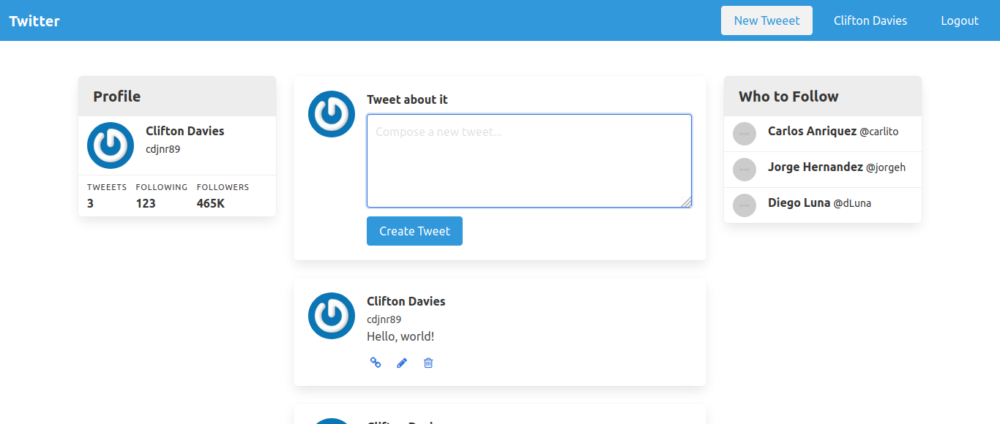

[](https://lbesson.mit-license.org/)
[](http://makeapullrequest.com)
[](https://github.com/ellerbrock/open-source-badges/)


# Twitter

> A minimalist Twitter clone with full user authentication, so users can only access areas of the site they are authorised to.



## Functionality

- User Account: Sign Up, Log in*, Update*, Delete*
- Tweet: Create*, Edit*, Delete*

## :toolbox: Tools & Technologies Used

- Ruby v2.6.5
- Ruby on Rails v5.2.4.3

## :rocket: Getting Started

### Dependencies

- SQLite3
- Devise v4.7.2
- Bulma v0.9.0
- Gravatar Image Tag v1.2
- Simple Form v5.0.2

### Configuration

1. [Install Ruby](https://www.ruby-lang.org/en/documentation/installation/)
2. Install Ruby on Rails
```
gem install rails -v 5.2.3
```
3. [Install SQLite3](https://www.sqlite.org/download.html), if you don't already have it installed locally.
4. Clone repo into your local environment using your favourite terminal:
```
git clone [this-repo-url].git
```
5. Open project directory
```
cd directory-name
```
6. Bulk install dependencies
```
bundle
```
7. Set up database
```
rake db:migrate
```
8. Run Locally
```
rails s
```
9. Visit http://localhost:3000/

## Author

👤 **Clifton Davies**

- Github: [@githubhandle](https://github.com/cliftondavies)
- Twitter: [@twitterhandle](https://twitter.com/cliftonaedavies)
- Linkedin: [linkedin](https://www.linkedin.com/in/clifton-davies-mbcs/)

## 🤝 Contributing

Contributions, issues and feature requests are welcome!

1. Fork it
2. Create feature branch
`git checkout -b feature/fooBar`
3. Commit changes
`git commit -am 'Add some fooBar'`
4. Push to the branch
`git push origin feature/fooBar`
5. Create new Pull Request

## Show your support

Give a ⭐️ if you like this project!

## Acknowledgments

- Andy Leverenz

## 📝 Copyright & License

Copyright (c) 2020 Clifton Davies.
This project is licensed under [MIT](https://opensource.org/licenses/MIT). See LICENSE file for details.